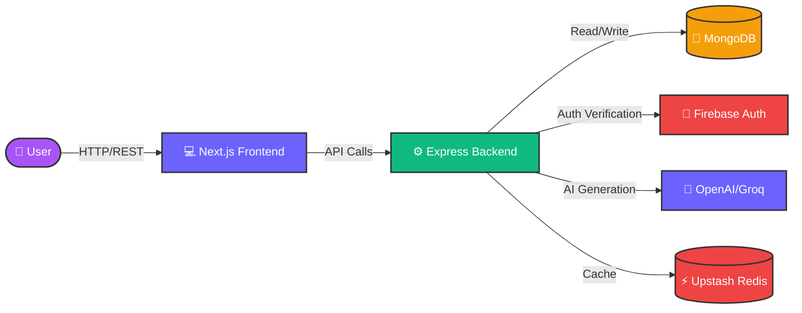

<div align="center">
  

  <br />

  <div align="center">
    
    
    
    
    
    
    
    
    
    
    
  </div>

  <br />

  <p align="center">
    <strong>Plan smarter, pack lighter, and travel better with our Gen-Z AI-powered travel companion.</strong>
  </p>

  <br />

  <h3>🚀 <a href="#-quick-start">Quick Start</a> • 📖 <a href="#-api-reference">Docs</a> • 🔧 <a href="#-configuration">Config</a> • 🤝 <a href="#-contributing">Contributing</a></h3>
</div>

<br />

## ✨ Features

<table>
  <tbody>
    <tr>
      <td width="5%" align="center">🤖</td>
      <td><strong>AI-Powered Recommendations</strong><br/>GPT-4o analyzes your trip and suggests highly personalized packing lists and travel recommendations.</td>
    </tr>
    <tr>
      <td width="5%" align="center">🗺️</td>
      <td><strong>Smart Trip Planning</strong><br/>Multi-step intuitive form for creating detailed travel plans, organizing itineraries, and managing trips.</td>
    </tr>
    <tr>
      <td width="5%" align="center">🛍️</td>
      <td><strong>Curated Product Catalog</strong><br/>Browse 20+ handpicked travel products with direct affiliate links to essential gear.</td>
    </tr>
    <tr>
      <td width="5%" align="center">📱</td>
      <td><strong>Progressive Web App</strong><br/>Install BagItUp directly on your device with offline support for accessing plans anywhere.</td>
    </tr>
    <tr>
      <td width="5%" align="center">⚡</td>
      <td><strong>Lightning Fast</strong><br/>Powered by Upstash Redis caching for instant AI responses and highly optimized load times.</td>
    </tr>
  </tbody>
</table>

## 🏗️ Architecture



## 📦 Prerequisites

Ensure you have the following installed before proceeding:

| Requirement | Badge |
| :--- | :--- |
| **Node.js** |  |
| **npm** |  |
| **Git** |  |
| **Docker** (Optional) |  |
| **MongoDB** |  |

## 🚀 Quick Start

### 1️⃣ Clone the repository

```bash
git clone https://github.com/IqbalHere/BagitUp.git
cd BagitUp
```

### 2️⃣ Install dependencies

<details>
<summary>💻 macOS/Linux & Windows</summary>

```bash
# Install root dependencies
npm install

# Install frontend dependencies
cd frontend
npm install

# Install backend dependencies
cd ../backend
npm install
cd ..
```
</details>

### 3️⃣ Configure Environment

Create `.env` and `.env.local` files by referencing the [Configuration](#-configuration) section below.

### 4️⃣ Seed Database (Optional)

```bash
cd backend
npx ts-node scripts/seedProducts.ts
cd ..
```

### 5️⃣ Run the Application

<details>
<summary>🏃 Using Concurrently (Recommended)</summary>

```bash
npm run dev
```

</details>

<details>
<summary>🐳 Using Docker</summary>

```bash
npm run docker:up
```

</details>

## 🔧 Configuration

> [!NOTE]
> Make sure to grab your API keys from OpenAI/Groq, MongoDB Atlas, and Firebase Console before starting the backend server.

**Backend (`backend/.env`)**

| Variable | Required | Description |
| :--- | :---: | :--- |
| `PORT` | ✅ | Backend API port (default: 4000) |
| `NODE_ENV` | ✅ | `development` or `production` |
| `MONGO_URI` | ✅ | Connection string for MongoDB database |
| `FIREBASE_SERVICE_ACCOUNT` | ✅ | JSON string of Firebase service account key |
| `GROQ_API_KEY` | ❌ | Groq API Key for AI inference (One of AI keys required) |
| `GEMINI_API_KEY` | ❌ | Gemini API Key for AI inference |
| `OPENAI_API_KEY` | ❌ | OpenAI API Key for AI inference |
| `UPSTASH_REDIS_REST_URL` | ❌ | Upstash Redis connection URL |
| `UPSTASH_REDIS_REST_TOKEN` | ❌ | Upstash Redis auth token |
| `STRIPE_SECRET_KEY` | ❌ | Stripe secret key for payments |
| `USE_STRIPE` | ❌ | Set to `true` to enable Stripe integration |

**Frontend (`frontend/.env.local`)**

| Variable | Required | Description |
| :--- | :---: | :--- |
| `NEXT_PUBLIC_API_URL` | ✅ | Backend API URL (default: http://localhost:4000) |
| `NEXT_PUBLIC_STRIPE_PUBLISHABLE_KEY` | ❌ | Stripe publishable key |
| `NEXT_PUBLIC_FIREBASE_API_KEY` | ✅ | Firebase project API key |
| `NEXT_PUBLIC_FIREBASE_AUTH_DOMAIN` | ✅ | Firebase Auth domain |
| `NEXT_PUBLIC_FIREBASE_PROJECT_ID` | ✅ | Firebase Project ID |
| `NEXT_PUBLIC_FIREBASE_STORAGE_BUCKET` | ✅ | Firebase Storage bucket |
| `NEXT_PUBLIC_FIREBASE_MESSAGING_SENDER_ID`| ✅ | Firebase Messaging Sender ID |
| `NEXT_PUBLIC_FIREBASE_APP_ID` | ✅ | Firebase App ID |

## 📖 API Reference

### Generate Recommendations
`POST /api/recommendations/generate`

| Parameter | Type | Required | Default | Description |
| :--- | :--- | :---: | :---: | :--- |
| `tripId` | string | ✅ | - | The ID of the trip |
| `destination` | string | ✅ | - | Travel destination |
| `duration` | number | ✅ | - | Length of the trip in days |
| `weather` | string | ❌ | - | Weather forecast string |

**Example Response:**

```json
{
  "success": true,
  "data": {
    "recommendations": [
      {
        "category": "Clothing",
        "items": [
          "3x T-Shirts",
          "1x Light Jacket",
          "2x Shorts"
        ]
      },
      {
        "category": "Electronics",
        "items": [
          "Universal Power Adapter",
          "Power Bank"
        ]
      }
    ]
  }
}
```

## 🛡️ Error Handling

| Scenario | Behavior |
| :--- | :--- |
| 🚫 **Invalid API Key** | Backend returns `401 Unauthorized` with clear message |
| 🌐 **Network Timeout** | Frontend shows gracefully animated toast notification |
| 📉 **AI Generation Fail** | Fallback to cached default lists if Redis is enabled |
| 🛠️ **Missing Env Vars** | Server fails to boot and logs exactly which variable is missing |

## 🧰 Development

### Commands

```bash
# Run both frontend & backend concurrently
npm run dev

# Run frontend tests
cd frontend && npm run test

# Run backend tests
cd backend && npm run test

# Lint the codebase
cd frontend && npm run lint
cd backend && npm run lint
```

### Project Structure

```text
📁 BagitUp/
├── 📁 frontend/                 # Next.js Application
│   ├── 📁 app/                 # App router structure
│   ├── 📁 components/          # Reusable UI elements
│   └── 📁 lib/                 # Utils & API integrations
├── 📁 backend/                  # Express API Server
│   ├── 📁 src/                 # Source code
│   │   ├── 📁 config/         # DB & Firebase configs
│   │   ├── 📁 controllers/    # Route controllers
│   │   ├── 📁 models/         # Mongoose models
│   │   └── 📁 routes/         # Express routes
│   └── 📁 scripts/             # Database seeders
├── 📁 shared/                   # Shared TypeScript types
├── ⚙️ docker-compose.yml       # Docker config
└── 📄 package.json              # Workspace setup
```

## 🛠️ Tech Stack

<div align="center">

| Component | Technology | Role |
| :---: | :--- | :--- |
| **Frontend** |  | App routing, server-side rendering, and UI |
| **Styling** |  | Utility-first responsive styling and UI |
| **Backend** |  | RESTful API server and routing |
| **Database** |  | NoSQL data persistence |
| **Auth** |  | Secure user authentication and management |
| **AI** |  | Intelligent recommendation engine |
| **Caching** |  | Fast data retrieval via Upstash |
| **Payments** |  | Monetization and payment processing |

</div>

## 🤝 Contributing

We welcome contributions! Please follow these steps to contribute:

1. **Fork** the repository
2. **Create a branch** for your feature (`git checkout -b feature/amazing-feature`)
3. **Commit** your changes (`git commit -m 'Add amazing feature'`)
4. **Push** to the branch (`git push origin feature/amazing-feature`)
5. **Open a Pull Request** against the `main` branch

## 📝 License

This project is licensed under the MIT License - see the [LICENSE](LICENSE) file for details.

<br />

<div align="center">
  

  <br />

  <p>Built with ❤️ by <a href="https://github.com/IqbalHere">Iqbal</a></p>

  <br />

  
  
  

  <br />
  <br />

  <strong>⭐ Star this repo if you found it useful! ⭐</strong>
</div>
